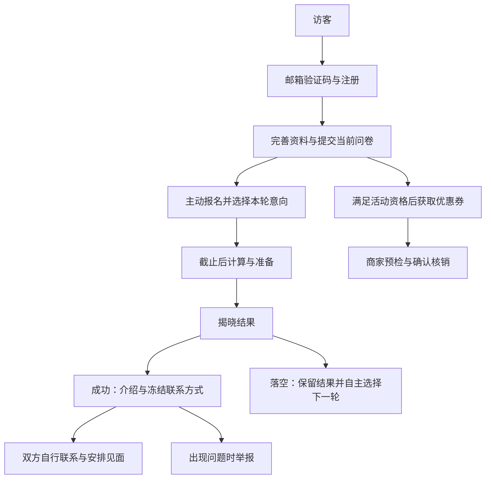

# 产品定位与用户路径

> 文档归属：[现行参考](README.md)。

LiLink 面向合作高校学生提供周期性 1v1 匹配：用户建立账号、提交资料与问卷，主动选择本轮交友或约会意向；系统在双方条件满足的候选中为每人最多生成一位对象，揭晓后展示介绍与联系方式，后续交流由双方自主安排。

每周常规匹配不要求购买人工服务；可选 VIP 提供高级筛选与匹配优先权，另有人工匹配服务登记。当前产品不能概括为“全部免费”。功能定义由当前源码证明，实际开放轮次、服务交付和部署版本仍需对应环境的证据。

## 主路径与入口

| 阶段 | 页面入口 | 用户可见结果与契约 |
| --- | --- | --- |
| 了解服务 | `/`、`/about`、`/schools`、`/faq`、`/updates` | 产品介绍、学校目录、轮次信息和公开统计；[缓存与失败行为](public-data-cache.md) |
| 建立账号 | `/register/school`、`/register/personal`、`/login`、`/forgot-password` | 邮箱验证、注册、登录和密码重置；[注册资格与账户边界](account.md) |
| 建立匹配资料 | `/dashboard/profile` | 昵称、介绍、基础资料、问卷与偏好；草稿不等于完整提交 |
| 决定本轮参与 | `/dashboard` | 在开放窗口中主动报名、选择 FRIEND/DATE/BOTH 或取消；[匹配资格](matching.md) |
| 查看结果 | `/dashboard/match`、`/dashboard/match/history` | 等待、落空、成功或受限状态；成功匹配在揭晓时直接提供联系方式 |
| 维护账户 | `/dashboard/me` | 联系方式、账户设置和注销；历史联系方式按冻结值读取 |
| 可选权益 | `/dashboard/vip` | 激活码兑换及权益状态；[VIP 契约](vip.md) |
| 邀请与优惠 | `/dashboard/referrals`、`/dashboard/coupons` | 个人邀请归因、邀请额度、可用券与历史；[优惠券契约](coupons.md) |
| 人工服务登记 | `/one-to-one` | 登录后提交经同意的登记信息，运营后续联系；登记成功不代表已收款或完成服务 |
| 商家核销 | `/merchant/login`、`/merchant/redeem` | 独立商家会话、动态码预检、金额核对和一次性确认核销 |
| 运营管理 | `/admin` | 学校、用户、问卷、轮次、举报、商家、活动、统计、审计及人工服务登记；[角色边界](topology.md) |

资料页由 [ProfileBootstrap](../../apps/web/src/app/dashboard/profile/profile-bootstrap.tsx) 加载，匹配结果由 [MatchClient](../../apps/web/src/app/dashboard/match/match-client.tsx) 展示。人工服务登记由 [MatchLeadsModule](../../apps/api/src/modules/match-leads/match-leads.module.ts) 关联当前账号，重复登记更新该账号记录并重置待联系状态。

## 产品边界

- 没有公开全站用户列表、无限浏览对象或站内即时聊天；联系方式只在受权的匹配读取中返回。
- 目前没有多人匹配链路。旧见面协商已退役，旧 meetup 页面转到匹配页；资料表和历史代码不代表仍有在线协商或反馈服务。
- 每轮显式报名；本轮成功或落空均不自动报名下一轮。硬条件、历史配对排除、拉黑和候选数量可能使用户落空，优先权不保证必配。
- 当前揭晓流程直接冻结联系方式并排队发送结果邮件，不再要求双方先点击“请求认识”。邮件进入 outbox 或 SMTP accepted 不证明已到真实收件箱。

主站文案与路径来源：[HomePageView](../../apps/web/src/app/home-page-view.tsx)、[人工服务页面](../../apps/web/src/app/one-to-one/page.tsx)。部署与用户行为验收分别按 [生产发布](../guides/production-release.md) 和 [浏览器 E2E](../guides/browser-e2e.md) 执行。
