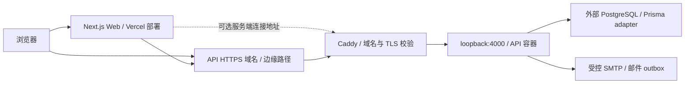

# 系统职责、数据流与部署拓扑

> 文档归属：[现行参考](README.md)。

本页说明当前 checkout 的工程和部署契约。运行环境可能使用不同提交；实际版本、DNS、主机、数据库 provider、容量与邮件平台配置由注明时间的受控核验记录证明。核查接口契约时先确定目标提交，核查生产事实时先确定运行提交和现场配置；历史记录只证明对应日期的状态。

## 工程职责

| 边界 | 维护位置 | 职责 |
| --- | --- | --- |
| Web | [Web package](../../apps/web/package.json) | Next.js 页面、同源路由、客户端状态与服务端数据读取 |
| API | [应用模块](../../apps/api/src/app.module.ts) | NestJS 认证、授权、业务事务、定时任务与邮件编排 |
| 协议与规则 | [共享入口](../../packages/shared/src/index.ts) | 跨端类型、转换与领域规则 |
| 持久化 | [Prisma schema](../../apps/api/prisma/schema.prisma) | 模型、约束与 migration 管理 |
| 数据库连接 | [Prisma client](../../apps/api/src/common/prisma/client.ts) | driver adapter 与连接配置 |
| 验证 | [E2E runner](../../scripts/e2e/run.mjs) | 隔离服务、合成数据、行为验收和回收 |

API 模块启用情况以 AppModule imports 为准；历史 schema、归档代码和备份目录不证明功能仍启用。

Web 使用 App Router，公开页面、用户 dashboard、运营 admin 和 merchant 页面分别承接各角色路径。服务端 bootstrap 聚合页面所需数据，客户端负责交互、写入和刷新；登录页跳转不能替代 API 授权。页面入口见 [用户路径](product.md)，聚合契约见 [page-bootstrap controller](../../apps/api/src/modules/account/page-bootstrap.controller.ts)，连接方式见 [服务端 API 路由](server-api-routing.md)。

| API 领域 | 主要职责 |
| --- | --- |
| Auth、Account、Questionnaire、School | 邮箱验证与会话、账户资料、问卷版本与答案、注册学校归属 |
| Cycles、DashboardSnapshot | 本轮报名、准备与揭晓、匹配求解、面向页面的结果视图 |
| Referral、Campaign、Coupon、PromotionDashboard | 邀请归因、活动资格、领券和用户推广汇总 |
| Merchant、MerchantSession、Redemption | 商家及员工、独立会话、动态码预检和核销事务 |
| Vip、MatchLeads | 激活码权益与人工服务登记 |
| Admin、AdminSession、AdminAnalytics | 运营身份、管理写入、业务统计与审计 |
| Mail、RetiredProductEvents | 邮件 outbox 投递与重试、退役事件保留期清理 |

共享包提供问卷答案与进度、硬条件、VIP 有效偏好、本轮意向、联系方式渠道、学校邮箱、券/TOTP 和安全跳转等跨端规则。它不承担数据库访问、会话授权或业务事务；API 仍须校验输入并执行授权，Web 的同规则提示不能替代这些检查。

## 数据领域与不变量

| 领域 | 主要模型 | 关键关系 |
| --- | --- | --- |
| 身份与学校 | User、School、SchoolDomain、EmailCode、UserContactMethod、AdminOperator | 用户邮箱和学校域名唯一；用户状态、测试标记与注销状态独立 |
| 资料与问卷 | UserProfile、QuestionnaireVersion、Question、QuestionnaireResponse、QuestionnaireResponseArchive | 每用户一份现行资料和答案；问卷发布可归档旧答案，归档不授予当前匹配资格 |
| 轮次与结果 | MatchCycle、CycleParticipation、Match、MatchParticipant、UserCycleDashboardSnapshot | 每用户每轮一份报名、最多一个匹配；结果与页面视图分开存储 |
| 安全与审计 | Report、Block、AuditLog、SystemSetting | 举报关联匹配；Block 有方向，但匹配排除检查任一方向 |
| 邮件 | OutboundEmail | dedupeKey 唯一；持久化队列与真实邮件到达是不同状态 |
| 优惠与核销 | Campaign、CouponTemplate、CampaignActivation、Coupon、CouponReadState、Merchant、MerchantUser、Redemption、ReferralEvent | 活动资格、券、商家授权与核销记录各自维护生命周期 |
| 增值服务 | VipActivation、MatchLead | 激活码 hash 唯一；人工服务登记关联用户，登记不代表支付成功 |

`CycleParticipation(cycleId,userId)` 和 `MatchParticipant(cycleId,userId)` 的唯一约束分别防止重复报名和同轮重复配对。每个 Match 恰好两位参与者、双方资格、历史配对排除由服务层保障，不能只靠 schema 推断；历史配对排除也不是全局 pair 唯一索引。

`CampaignActivation(userId,campaignId)`、`Coupon(userId,templateId)` 和 `Redemption.couponId` 唯一约束配合事务与状态比较，防止重复资格、重复领同模板和重复核销。VIP 激活/撤销还使用行锁串行处理。完整规则分别由 [匹配](matching.md)、[账号](account.md)、[优惠券](coupons.md) 和 [VIP](vip.md) 维护。

页面快照以 `(userId,cycleId)` 为主键，是可重建的视图。配对时保存的介绍和匹配资料、揭晓时冻结的联系方式、当前昵称和学校不是同一数据时点：资料编辑可同步页面快照，举报、拉黑和注销可限制展示；不能把快照理解为永远不变的个人信息副本。构建与授权逻辑见 [DashboardSnapshotService](../../apps/api/src/common/dashboard/dashboard-snapshot.service.ts)。

Meetup、MatchFeedback、ProductEvent 等历史模型仍可能存在，但 AppModule 没有相应在线见面协商、匹配反馈或产品事件采集模块。统计现行口径见 [运营统计](analytics.md)，不从历史表名推断产品能力。

## API 认证与授权

API 全局前缀为 `/v1`。普通用户、运营与商家使用各自 Cookie 和 JWT 签名配置，默认 Cookie 名依次为 `lilink_token`、`lilink_admin_token`、`lilink_merchant_token`，有效期默认 14 天；Cookie 为 HttpOnly、SameSite=Lax，生产启用 Secure。生产跨子域访问还须同时满足 Cookie domain、请求 credentials 与 `CLIENT_ORIGIN` 配置。

| 路径族 | 访问边界 |
| --- | --- |
| `/v1/health`、`/v1/public/*`、`/v1/questionnaire/current` | 公开读取；不返回个人资料或联系方式 |
| `/v1/auth/*` | 验证码、注册、登录、找回密码等公开入口；`/auth/me` 仍需用户会话 |
| `/v1/me/*`、`/v1/referral/events` | 普通用户会话；身份来自 guard，数据读取必须限定本人或已授权匹配 |
| `/v1/referral/click` | 公开邀请点击归因，受输入校验、去重与限流约束 |
| `/v1/admin-session/*`、`/v1/admin/*` | 独立运营登录与退出；管理接口与 `/admin-session/me` 要求有效运营账号 |
| `/v1/merchant/auth/*`、`/v1/merchant/redeem*` | 商家登录与退出公开；`/merchant/auth/me` 及核销接口要求商家员工与商家均有效，范围来自该员工所属 merchantId |
| `/v1/internal/cycles/*` | `x-cron-secret` 受控调用；不是普通用户或运营 JWT 入口 |

[JwtAuthGuard](../../apps/api/src/common/auth/jwt-auth.guard.ts) 在受保护请求中读取用户状态，拒绝非 ACTIVE 或已注销账号；仅合并并发中的同用户读取，不持久缓存活跃状态。[AdminGuard](../../apps/api/src/common/auth/admin.guard.ts) 校验 AdminOperator.isActive；[MerchantGuard](../../apps/api/src/common/auth/merchant.guard.ts) 同时校验员工与商家，客户端不能通过自报 merchantId 扩展核销范围。

[API 入口](../../apps/api/src/main.ts) 启用 Helmet、Cookie 解析及白名单 DTO 校验，拒绝额外字段。CORS 只给配置允许的浏览器 origin 返回凭据许可，无 Origin 的服务端请求仍可进入认证流程；CORS 不能替代权限检查。默认限流、公开读取和认证敏感入口的专用限流由 guard 与 controller 定义。Swagger `/docs` 只在非生产环境启用。

## 部署声明

- [生产 Compose](../../docker-compose.prod.yml) 只声明 API，绑定 loopback，不创建本地 PostgreSQL。外部数据库连接由受控 runtime 配置决定。
- [Caddyfile](../../Caddyfile) 声明 API 域名、TLS 入口、loopback 代理和固定 BIMI 路由。此文件证明配置契约，不证明 DNS 或主机现状。
- Web 使用配置的 API HTTPS base URL；可选连接方式由 [服务端 API 路由](server-api-routing.md) 定义。
- [本地 Compose](../../docker-compose.local.yml) 声明本地 PostgreSQL、Mailpit 和可选 API，其服务不用于生产部署。

## 配置边界

API 生产配置挂载为 `api_env`，由 [production-entrypoint.mjs](../../apps/api/scripts/production-entrypoint.mjs) 在进程内加载。新 exec shell 需要同一 helper。API 镜像的 Sentry source maps 使用 BuildKit `sentry_auth_token`，不通过 runtime 或 build argument 暴露。Web 由 [Next 配置](../../apps/web/next.config.ts) 在构建时读取受控的 `SENTRY_AUTH_TOKEN`；该上传凭据不添加 `NEXT_PUBLIC_` 前缀，不写入公开工件。

端口、image、Dockerfile、secret 查询 Compose；工具版本查询根工具链声明；启动的 migration 与 bootstrap 顺序查询入口脚本。步骤统一见 [生产发布](../guides/production-release.md)。

PostgreSQL 通过 Prisma driver adapter 建立连接池，默认上限 20、checkout 连接超时 10 秒；`DATABASE_CONNECTION_LIMIT` 与 `DATABASE_POOL_TIMEOUT_SECONDS` 由 [client.ts](../../apps/api/src/common/prisma/client.ts) 解析，后者允许 0 禁用该超时。这些是进程配置，不能由连接 URL 中的历史 Prisma 参数替代。公开页面另有多层缓存，其时效与数据库连通性界限见 [缓存策略](public-data-cache.md)。
