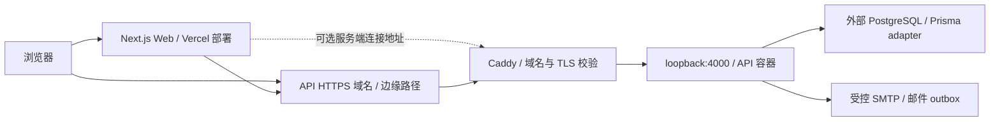

# 系统职责、数据流与部署拓扑

> 文档归属：[现行参考](README.md)。

本页说明当前 checkout 的工程和部署契约。运行环境可能使用不同提交；实际版本、DNS、主机、数据库 provider、容量与邮件平台配置由注明时间的受控核验记录证明。本次重整没有把旧交接快照当成现场状态。

## 工程职责

| 边界 | 维护位置 | 职责 |
| --- | --- | --- |
| Web | [Web package](../../apps/web/package.json) | Next.js 页面、同源路由、客户端状态与服务端数据读取 |
| API | [应用模块](../../apps/api/src/app.module.ts) | NestJS 认证、授权、业务事务、定时任务与邮件编排 |
| 协议与规则 | [共享入口](../../packages/shared/src/index.ts) | 跨端类型、转换与领域规则 |
| 持久化 | [Prisma schema](../../apps/api/prisma/schema.prisma) | 模型、约束与 migration 管理 |
| 数据库连接 | [Prisma client](../../apps/api/src/common/prisma/client.ts) | driver adapter 与连接配置 |
| 验证 | [E2E runner](../../scripts/e2e/run.mjs) | 隔离服务、合成数据、行为验收和回收 |

API 模块启用情况以 AppModule imports 为准；历史 schema、归档代码和备份目录不证明功能仍启用。

## 部署声明

- [生产 Compose](../../docker-compose.prod.yml) 只声明 API，绑定 loopback，不创建本地 PostgreSQL。外部数据库连接由受控 runtime 配置决定。
- [Caddyfile](../../Caddyfile) 声明 API 域名、TLS 入口、loopback 代理和固定 BIMI 路由。此文件证明配置契约，不证明 DNS 或主机现状。
- Web 使用配置的 API HTTPS base URL；可选连接方式由 [服务端 API 路由](server-api-routing.md) 定义。
- [本地 Compose](../../docker-compose.local.yml) 声明本地 PostgreSQL、Mailpit 和可选 API，其服务不用于生产部署。

## 配置边界

API 生产配置挂载为 `api_env`，由 [production-entrypoint.mjs](../../apps/api/scripts/production-entrypoint.mjs) 在进程内加载。新 exec shell 需要同一 helper。API 镜像的 Sentry source maps 使用 BuildKit `sentry_auth_token`，不通过 runtime 或 build argument 暴露。Web 由 [Next 配置](../../apps/web/next.config.ts) 在构建时读取受控的 `SENTRY_AUTH_TOKEN`；该上传凭据不添加 `NEXT_PUBLIC_` 前缀，不写入公开工件。

端口、image、Dockerfile、secret 查询 Compose；工具版本查询根工具链声明；启动的 migration 与 bootstrap 顺序查询入口脚本。步骤统一见 [生产发布](../guides/production-release.md)。
