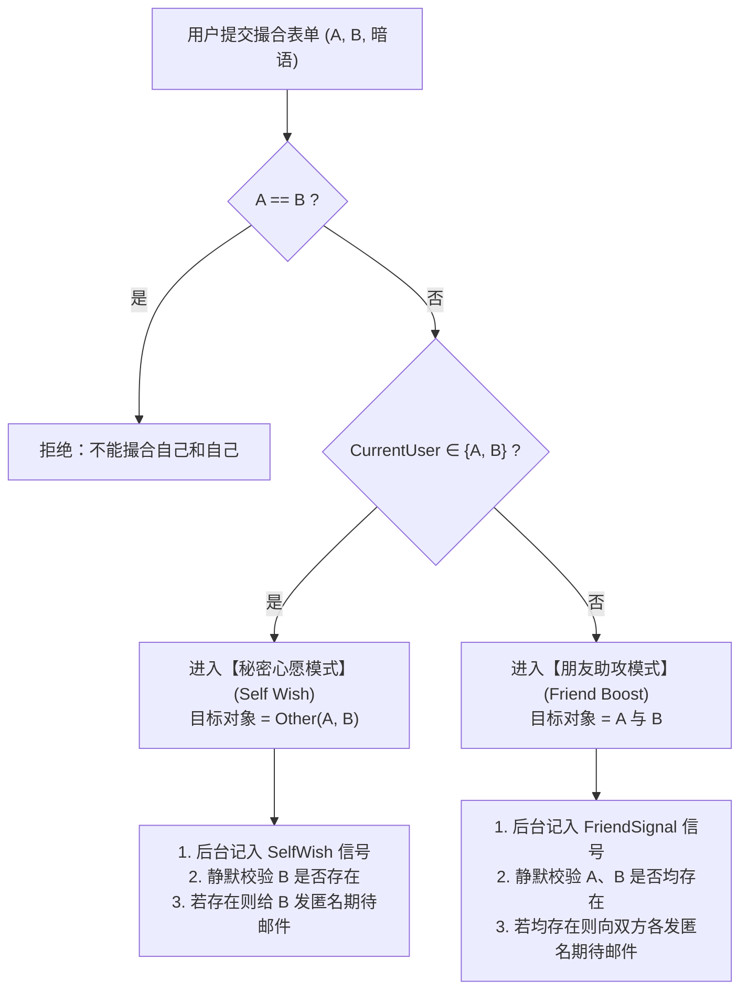

> **文档归属**：本设计遵循 [docs/README.md](./README.md) 规范，是 LiLink 关系网络与匹配机制演进的基准设计文档。

# 偷偷助攻与双人撮合机制设计（丘比特活动 · Project Cupid）

- **日期**：2026-09-11
- **状态**：设计完成（待评审）
- **核心定位**：将“好友助攻”、“单向暗语”与“秘密心愿”统一抽象为原子动作——**撮合两个人**，在运营层包装为灵动温暖的**「丘比特活动（Project Cupid）」**。通过输入主体判定与隐式意图路由，在零社交压力、零隐私泄露的前提下，将高纯度的人际关系信号无缝注入 LiLink 的周度最大权匹配网络中。普通邮件底部仅展示轻量预热文案*“LiLink 新增了丘比特机制，触发会有彩蛋哦”*；**唯有通过暗语机制匹配上的邮件**，才会随信附带专属“小心思便签”，并在配对端内开启多个等待发掘的丘比特 Tips 小彩蛋。

---

## 一、设计背景与核心理念

### 1.1 现状痛点：功能割裂与社交负担
在过往的社交产品探索中，平台往往倾向于分别构建独立功能模块：
1. **暗恋/心愿模式**：向特定对象发送暗语，但容易给发起者带来“万一被识破”的心理包袱与表白焦虑；
2. **好友助攻模式**：第三方替两个好友牵线，但若直接向当事人透露对方是谁，极易造成“有人觉得你应该和 TA 谈恋爱”的越俎代庖式社死与尴尬；
3. **内容社区流**：试图通过公开动态或广场撮合，但带来巨大的运营供给压力与低匹配效率。

### 1.2 核心洞察：统一动作——“撮合两个人”
实际上，不需要在产品上分裂出“助攻”、“暗恋”、“暗语”三个独立工具，它们在底层逻辑上完全可以统一为一个纯粹的原子动作：

$$\mathbf{Matchmaking}(A, B, \text{SecretNote})$$

**系统根据所填两个邮箱中是否包含当前登录用户，自动识别当前行为是“我想认识 TA（秘密心愿）”还是“我想撮合他们（朋友助攻）”。**

- **极简心智**：用户只需理解一个动作——**“把两个人放进 LiLink 的缘分里，帮他们增加相遇概率”**。
- **零额外内容负担**：不造广场、不维护内容流，直接复用 LiLink 原生的每周匹配轮次（`MatchCycle`）与邮件直达通道（Direct Mail）。
- **人类关系信号入图**：将原本纯由问卷算法计算的契合度，叠加上真实人际网络中的“背书”与“心愿”，让算法兼具理性深度与人性感性。
- **丘比特机制分层发酵**：普通邮件仅附带*“LiLink 新增了丘比特机制，触发会有彩蛋哦”*作轻量预告；唯有通过暗语机制撮合成功的配对，才解锁全套“小心思便签”与端内可发掘的 Tips 彩蛋矩阵。

---

## 二、统一入口与智能模式路由

### 2.1 极简产品包装：“偷偷助攻 · 丘比特计划”
前端入口以极轻的工具形态呈现，命名为**「偷偷助攻」**（或在活动期称为**「丘比特计划」**）。

```text
┌──────────────────────────────────────────────┐
│                  偷偷助攻                    │
│                                              │
│         觉得两个人很合适？                   │
│         给他们增加一点相遇的概率。           │
│                                              │
│  第一个人的学校邮箱                          │
│  [ alice@pku.edu.cn                        ] │
│                                              │
│  第二个人的学校邮箱                          │
│  [ bob@pku.edu.cn                          ] │
│                                              │
│  想留一句话吗？（选填，最多 30 字）          │
│  [ 你们两个真的都特别喜欢潜水。            ] │
│                                              │
│               [ 偷偷助攻一下 ]               │
└──────────────────────────────────────────────┘
```

### 2.2 模式自动判定规则

设当前登录用户的认证学校邮箱为 $CurrentUser$，用户提交的两个邮箱分别为 $A$ 与 $B$（提交时不分顺序，系统自动去重与归一化处理）：



### 2.3 交互彩蛋：动态文案渐变
当系统检测到用户在两个输入框中填入了**本人邮箱**时，界面无需刷新跳转，下方即时浮现动态微文案彩蛋：

> **原来其中一个是你 👀**  
> 那这次会被视为你的秘密心愿。如果条件合适，我们会悄悄提高你们相遇的概率。

此设计消除了用户在功能选择上的认知摩擦，让“表达好感”变成一种轻松、隐秘且自然的探索。

---

## 三、场景一：包含本人的“秘密心愿”机制

当 $A = CurrentUser$ 且 $B \neq CurrentUser$（或反之）：

### 3.1 业务含义
当前用户希望在下一轮或未来的匹配周期中，系统能为自己与 $B$ 赋予更高的相遇概率。

### 3.2 邮件通知与“小心思便签”
系统向 $B$ 发送匿名通知邮件，但**绝对不透露发送者 $A$ 是谁**，并在随信附带专属的**「丘比特小心思便签」**：
- **邮件主题**：有人在 LiLink 偷偷给你增加了一点相遇概率 💌
- **邮件内容**：
  > 嗨，同学：  
  > 有人通过 LiLink 给你留了一点小心思。  
  > 「还记得那次海边吗？」  
  > 对方也偷偷增加了与你相遇的概率。如果未来某期你们都参与了匹配，算法会努力让你们相遇。  
  > 
  > 💌 **丘比特的小心思 Tip**：  
  > 「听说丘比特正在为你校准箭头的偏航角。在周日揭晓前，不妨在自习室多抬头看两眼，说不定心愿的主人就坐在不远处。」

**设计准则**：
- **无心理负担**：发起者 $A$ 没有任何“被直接拒绝”或“表白未遂”的社交风险。
- **制造期待与趣味**：接收方 $B$ 获得极强的情绪价值与神秘感，暗语与丘比特小心思便签成为记忆钩子，促使 $B$ 持续保持在 LiLink 的活跃与参配意愿。

### 3.3 关系信号与双向奔赴闭环
1. **单向心愿**：后台持久化一条有向心愿边：
   
   $$SelfWish(A, B) = 1$$
   
   在下一期算法求解时，为候选边 $(A, B)$ 注入单向增益分（$+10$ 分）。
2. **双向奔赴（奇迹触发）**：若未来 $B$ 也在自己的端内输入了撮合 $(B, A)$：
   
   $$SelfWish(A, B) = 1 \quad \land \quad SelfWish(B, A) = 1$$
   
   > [!IMPORTANT]
   > **最高特权法则：直接抛开所有约束，下一轮直接强制匹配上，并触发专属彩蛋！**  
   > 真实世界中互相许下秘密心愿是极其罕见的浪漫奇迹。算法的终极目标是成全人类真实缘分，绝不能被冷冰冰的机械规则所拆散。  
   > 因此，当且仅当双向心愿达成时：  
   > - **彻底抛开所有常规硬条件与软分约束**：不论双方意图是否冲突（如 FRIEND vs DATE）、不论学校/专业排他、不论问卷契合度高低，**全部豁免跳过**；  
   > - **下一轮直接保送配对（Guaranteed Direct Match）**：直接在下一轮匹配轮次中强制锁定为配对对象，无需参与 Blossom 图竞价，提前从常规匹配池中锁定；  
   > - **触发专属双向奔赴浪漫彩蛋**：揭晓时刻向双方展示专属的全屏动效、对称暗语墙、“命中注定”专属勋章与仪式感卡片！

---

## 四、场景二：撮合第三方的“朋友助攻”机制

当 $A \neq CurrentUser \land B \neq CurrentUser$（由第三方 $C$ 提交）：

### 4.1 业务含义
$C$ 认为 Alice 和 Bob 在现实中非常投缘或合适，作为共同好友为他们提供背书。用户还可附上一句撮合理由/暗语，如：
> “你们两个真的都特别喜欢潜水。”

### 4.2 邮件期望工程与反尴尬防线
当 $A$ 与 $B$ 均符合接收条件时，系统分别向二人投递通知邮件：
- **邮件主题**：你的朋友在 LiLink 偷偷为你申请了一位丘比特 🎯
- **邮件内容**：
  > 嗨，Alice / Bob：  
  > 你的朋友在 LiLink 偷偷撮合了你和另一个人。  
  > 助攻暗语：「你们两个真的都特别喜欢潜水。」  
  > 也许在不久后的周度揭晓中，你们就会遇见。  
  > 
  > 🎯 **丘比特的小心思 Tip**：  
  > 「世界上至少有两个人同时觉得你们应该认识。丘比特已经在暗中调高了你们相遇的时空交错刻度，保持期待。」

> [!IMPORTANT]
> **绝对禁止向双方提前指明对方是谁！**  
> 若直接告诉 Alice “你朋友觉得你该和 Bob 谈恋爱”，第三方就变成了强行施压的红娘，极易引发社死与防御心理。  
> 必须将对方身份封存在系统后台，仅通过算法提高二人配对概率。

### 4.3 “邮件造期待，算法定揭晓”闭环
整个助攻机制通过三位一体的链路达成极致的用户体验：
1. **邮件制造期待**：双方各自收到助攻通知与暗语，带着好奇等待周度揭晓；
2. **算法注入边权**：$C$ 的助攻转化为图匹配中的边权增益 $FriendSignal_C(A, B)$；
3. **揭晓终极惊喜**：唯有当周日晚算法真正将 $A$ 与 $B$ 匹配在一起时，揭晓卡片上才豁然呈现：
   > **本轮揭晓彩蛋**：你们收到了一条好友偷偷助攻！  
   > 助攻暗语：「你们两个真的都特别喜欢潜水。」  
   > *（原来之前那条邮件说的人就是 TA！）*

这一刻的情绪释放与心智闭环，远超任何机械的算法匹配。

---

## 五、匹配机制：关系信号与撮合权重模型

LiLink 遵循周度匹配周期（MatchCycle）。引入本机制后，人际关系信号作为核心意图权重纳入匹配评估体系：

### 5.1 候选综合评价公式
对于进入常规候选池的两名用户 $(A, B)$，综合匹配契合度定义为：

$$FinalScore(A, B) = \alpha \cdot M(A, B) + \beta \cdot S(A, B) + \gamma \cdot F(A, B) + \delta \cdot R(A, B)$$

| 分项 | 符号 | 业务含义 | 计算基准与取值范围 |
| :--- | :---: | :--- | :--- |
| **问卷匹配分** | $M(A, B)$ | 原生问卷各维度计算的软性契合度 | 基准分 $48$ 分，满分经归一化映射至 $[70, 100]$ |
| **本人心愿信号** | $S(A, B)$ | 本人是否存在单向主动心愿 | 单向心愿 $+10$ 分；**双向心愿直接走特权保送，不入打分池** |
| **朋友助攻信号** | $F(A, B)$ | 外部好友提供的撮合增益 | 单次助攻 $+2$ 分，受上限截断约束 |
| **行为辅助信号** | $R(A, B)$ | 历史活跃度、跨校偏好等边缘加成 | 浮动增益 $[0, 5]$ 分 |

### 5.2 信号分级与“心意高于规则”原则
权重设计的核心哲学是：**本人表达的主观偏好远高于第三方推断；而双方互相选择的真实心意，高于系统一切常规约束。**

1. **第三方助攻有上限**：
   为防止一个寝室或小圈子发起“人海战术”恶意刷分操控全局图匹配，对朋友助攻设置硬性饱和阈值：
   
   $$FriendBoost(A, B) = \min\left(\sum_{k \in Supporters} w_k,\ 8\right)$$
   
   - 单人助攻：$+2$ 分；
   - 3 人独立助攻：$+6$ 分；
   - 4 人及以上助攻：严格截断封顶在 $+8$ 分。
2. **本人单向心愿**：$+10$ 分（高于任何第三方助攻总和，体现自我意愿优先）。
3. **双向心愿互选（特权保送通道）**：
   不参与普通打分竞争，由系统直接前置提取，作为 **最高优先级保送对（Guaranteed Match Pair）** 直接匹配。

### 5.3 严格硬条件守门与双向奔赴特权豁免
- **常规匹配、单向心愿与朋友助攻**：必须严格经过底层双向硬条件守门：
  - 意图必须存在交集（`FRIEND` / `DATE` / `BOTH`）；
  - 性别与取向偏好一致；
  - 历史已成功配对过排除、双方相互 `Block` 排除；
  - 测试账号（`isTest=true`）及未提交问卷者绝对隔离。
- **双向奔赴特权豁免（All-Constraint Bypass）**：
  > [!IMPORTANT]
  > **若双方互相填写了彼此（双向心愿），直接抛开所有常规约束！**  
  > 无论是意图冲突（例如一人选 FRIEND 一人选 DATE）、学校排他约束、还是问卷答案完全相悖，系统**全部无条件放行**，并在下一轮周期开始时直接强行匹配成功，绝不因为任何算法参数拆散互相奔赴的两个人。  
  > *（底线约束：仅保留防止账号已注销或因严重违规被 Banned）*

---

## 六、安全与隐私：统一存在性检查与防探测设计

### 6.1 盲投机制（Blind Submission）
校园社交中极易出现恶意行为：“有人拿着全班 50 个人的学号邮箱挨个输入，通过系统返回的报错探测谁在用 LiLink”。

为此，本机制建立严格的**盲投防御规范**：

> [!CAUTION]
> **界面与系统反馈绝对不泄露目标邮箱的存在性或注册状态！**  
> 无论目标用户是否已注册、是否激活、问卷是否完成，前端统一返回毫无差异的成功状态文案。

- **自己模式统一返回**：
  > “你的心意已经收到。如果符合条件，我们会偷偷帮你送达。”
- **助攻模式统一返回**：
  > “助攻已经收到。如果双方符合条件，它会悄悄生效。”

### 6.2 后台静默校验与发信门控
提交后，系统在后台进行静默校验与条件过滤：

| 模式 | 门控判定逻辑 | 成立动作 | 不成立动作 |
| :--- | :--- | :--- | :--- |
| **秘密心愿** | $Exists(B) \land IsActive(B)$ | 1. 记入有效心愿库<br/>2. 投递匿名邮件至 $B$ | 静默丢弃发信，保留单向心愿记录（若 $B$ 日后注册激活，可延迟生效） |
| **朋友助攻** | $Exists(A) \land Exists(B) \land IsActive(A) \land IsActive(B)$ | 1. 记入有效助攻库<br/>2. 分别投递匿名邮件至 $A$ 与 $B$ | **只要任意一方未注册或未激活，双方均不发信**（防止单侧暴露） |

### 6.3 频率控制与反骚扰风控
1. **周期提交配额**：单个用户每个周度周期（MatchCycle）最多提交 **3 次**撮合动作（含心愿与助攻），避免恶意泛滥；
2. **幂等与关系去重**：同一发送者在同一轮次内针对同一对无序集合 $\{A, B\}$ 多次提交，自动覆盖前次暗语，权重不重复累加；
3. **内容安全审核**：暗语文本限制最多 30 个字符，接入敏感词与违规词过滤，命中直接静默阻断或拒绝。

---

## 七、丘比特活动彩蛋体系与 Tips 探索矩阵（Easter Eggs & Cupid Tips Matrix）

凡是通过“丘比特活动”（单向心愿、朋友助攻、双向奔赴）促成的匹配，平台不再仅仅呈现冰冷的匹配结果，而是贯穿**“普通邮件轻预热、暗语邮件发小心思”**与**“端内多重 Tips 彩蛋等待发掘”**，赋予整个产品旅程饱满的趣味性与情绪价值。

### 7.1 邮件分层设计：普通邮件预告 vs 暗语匹配邮件专属小心思

> [!IMPORTANT]
> **邮件彩蛋分层原则**：并非全链路所有邮件都无差别发送彩蛋！  
> - **普通邮件（未触发暗语机制的常规匹配信、系统信等）**：绝不剧透具体小心思或彩蛋，底部仅固定展示一行轻量预热文案：  
>   > **「LiLink」新增了丘比特机制，触发会有彩蛋哦 🏹**  
> - **通过暗语机制匹配上的邮件（及暗语通知信）**：只有通过撮合/暗语机制促成的匹配，才会随信附发专属的 **【💌 丘比特的小心思】** 动态便签，并提示端内隐藏彩蛋 Tips。

#### 暗语匹配专属邮件便签库（Cupid Whispers Library）

| 邮件类型 | 接收对象 | 核心小心思便签文案（Cupid Whisper Tip） |
| :--- | :--- | :--- |
| **秘密心愿通知信** | 被暗恋方 $B$ | <ul><li>「听说丘比特正在为你校准箭头的偏航角。在周日揭晓前，不妨在自习室多抬头看两眼，说不定心愿的主人就坐在不远处。」</li><li>「世界上有 80 亿人，但此刻有人在 LiLink 把他的相遇筹码单向压在了你身上 💫」</li><li>「有一份心意正在向你飞奔而来，不必猜 TA 是谁，让周日晚上的风替你们回答。」</li></ul> |
| **朋友助攻通知信** | 被助攻双方 $A$ & $B$ | <ul><li>「世界上至少有两个人同时觉得你们应该认识。丘比特已经在暗中调高了你们相遇的时空交错刻度，保持期待。」</li><li>「有共同好友在默默替你们使劲。缘分有时候不需要自己硬闯，让丘比特替你们推一把 🎯」</li><li>「这是一次来自朋友的预谋相遇，周日揭晓时，记得去寻找那张专属助攻暗语卡。」</li></ul> |
| **周度匹配揭晓信（暗语撮合对）** | 撮合成功双方 | <ul><li>「叮！本周丘比特正中红心 💘 你们的相遇里藏着人类关系的秘密线索。卡片里藏了好几个等待发掘的小彩蛋 Tips，快去端内刮开看看！」</li><li>「恭喜被丘比特翻牌！你们的匹配卡片中已被植入了专属彩蛋徽章，点击它会有惊喜。」</li></ul> |
| **双向奔赴奇迹信** | 互选双方 | <ul><li>「✨ 丘比特本周宣布提前放假——因为你们俩不约而同射中了彼此！点开端内，查收专属你们的流光奇迹夜。」</li><li>「系统打破了所有常规规则，甚至连算法都在为你们让路。今晚只属于命中注定。」</li></ul> |
| **交换联系引荐信（暗语撮合对）** | 交换成功双方 | <ul><li>「第一次微信开场白不知道说什么？试试直接把这封邮件截图甩过去：‘听说我们是被丘比特选中的幸运儿’ ☕」</li><li>「破冰第一题：不妨问问对方‘你猜当初帮我们助攻的那位共同朋友到底是谁？’」</li></ul> |

---

### 7.2 匹配揭晓页与端内的“丘比特 Tips 探索”机制

匹配成功的双方在进入结果页或见面会话时，卡片右上角将点亮一枚带有微光的 **「丘比特金羽毛（Cupid Feather）」**。用户点击或滑动时，可以逐步发掘以下趣味彩蛋 Tips：

```text
┌─────────────────────────────────────────────────────────┐
│                      ✨ 丘比特配对                      │
│                                                         │
│   [ 对方昵称 / 头像 ]                 契合度：92%       │
│                                                         │
│  ┌───────────────────────────────────────────────────┐  │
│  │ 🪶 发现丘比特小彩蛋！点击解锁 3 个隐藏 Tips        │  │
│  └───────────────────────────────────────────────────┘  │
│                                                         │
│   Tip 1 · 🕵️‍♂️【暗语侦探任务】                           │
│   你们收到了一条来自好友的助攻暗语：「喜欢潜水」。       │
│   破冰的第一项任务：猜猜究竟是哪位共同好友在暗中撮合？   │
│   如果猜中了，下次吃饭记得敲诈 TA 一杯奶茶！            │
│                                                         │
│   Tip 2 · 🏹【丘比特手抖纪录】                          │
│   丘比特射箭时手抖了 0.5 秒，本来你们学院完全不同，     │
│   结果偏航正中靶心——看！你们居然都在问卷里选了「深夜骑车」│
│                                                         │
│   Tip 3 · ☕【咖啡馆线下暗号】                          │
│   凭此界面前往校门口合作咖啡厅，对店员说出暗号          │
│   「丘比特在喝美式」，可免费双人升级大杯燕麦奶！        │
│                                                         │
│   [ 摇一摇抽取今日破冰锦囊 🎲 ]       [ 申请交换微信 ] │
└─────────────────────────────────────────────────────────┘
```

#### 探索小彩蛋矩阵一览：
1. **Tip 1 · 助攻侦探任务（The Wingman Detective）**：
   - 将匿名助攻暗语包装为社交破冰游戏。双方见面时的第一个共同话题不再是枯燥的自我介绍，而是化身“侦探”一起推理排查是身边的哪位共同好友，瞬间拉近心理距离。
2. **Tip 2 · 丘比特手抖纪录（The Serendipity Glitch）**：
   - 算法从双方问卷中挖掘一项**最冷门但重合的多选项**（如“小众乐队”、“深夜食堂”、“复古胶片”），打上“丘比特手抖偏航但奇迹命中”的幽默标签。
3. **Tip 3 · 丘比特摇摇乐破冰锦囊（Conversation Sparks）**：
   - 在见面协商页提供动态抽签交互，摇一摇掉落趣味破冰话题：
     - *“分享一件你最近觉得‘要是有人一起吐槽就好了’的小事”*；
     - *“如果现在可以瞬间瞬移，你想去地球上的哪一个角落？”*；
     - *“大学里做过的最离谱但最快乐的一件事是什么？”*。
4. **Tip 4 · 线下咖啡馆对暗号（Offline Coffee Egg）**：
   - 联动 LiLink 现有的商家卡券体系，持“丘比特匹配页面”至线下合作商户，对店员说出周期暗号即可触发赠饮加料或双人立减，把线上浪漫落地为实体触感。
5. **Tip 5 · 助攻功德回执（The Wingman Karma Loop）**：
   - 当 $A$ 与 $B$ 线下见面完成核销/互评后，系统向最初的发起者 $C$ 静默推送一张**「丘比特感谢卡」**：
     > 💌 *“你上周撮合的两位好友今天线下见面啦！世界因你的轻轻一推多了一点浪漫，丘比特为你记了一笔社交功德 ✨”*。
   - 发起者收获极大的成人之美成就感，驱动其在后续周期中继续发起助攻，形成自增长飞轮。

---

### 7.3 双向奔赴专属浪漫彩蛋（Mutual Easter Egg Spec）

当且仅当本轮匹配是由双方互选心愿触发时（`isMutualWishEasterEgg = true`），前端在周度揭晓页面直接切换为**最高仪式感彩蛋形态**：

#### 7.3.1 视觉特效与动效设计
- **专属动效**：进入揭晓页面时，常规卡片被金色/星空流光背景替代，伴随全屏粒子心动微动效与渐变光晕；
- **打破数字常规**：普通匹配卡片展示的具体百分比契合度（如 82%）被隐藏，直接置换为定制动态徽章：
  > **「 双向奔赴 · 命中注定 」**（契合度：$\infty$ / 100%）

#### 7.3.2 双向暗语对映墙（Mirror Secret Notes）
卡片中央不再堆叠冗长的问卷选项对比，而是以镜像对称形式点亮双方曾写下的秘密暗语：

```text
┌──────────────────────────────────────────────────┐
│             ✨ 奇迹发生了 · 双向奔赴             │
│                                                  │
│   你们不约而同在 LiLink 许下了与对方相遇的心愿。 │
│   系统抛开了所有常规规则，把你们带到了彼此面前。 │
│                                                  │
│  ┌──────────────────────┐  ┌───────────────────┐ │
│  │     TA 留给你的暗语   │  │   你留给 TA 的暗语 │ │
│  │                      │  │                   │ │
│  │ 「还记得那次海边吗？」│  │ 「其实在自习室就  │ │
│  │                      │  │   很想认识你了」   │ │
│  └──────────────────────┘  └───────────────────┘ │
│                                                  │
│            契合度：命中注定 (100%)               │
│                                                  │
│              [ 开启专属破冰对话 ]                │
└──────────────────────────────────────────────────┘
```
> *注：若某一方在提交撮合时未填写自定义暗语，则系统自动替换为浪漫默认暗语：「TA 曾偷偷为你增加了相遇的概率 💫」。*

#### 7.3.3 破冰特权与商家礼遇
- **专属破冰引荐**：双方点击交换联系方式后，引荐邮件中自动附带“双向心愿奇迹”专属贺信；
- **平台免单特权**：为双向奔赴配对直接赠送一张 LiLink 合作高校周边咖啡店的“双人同行·奇迹免单券”，从线上心意无缝衔接至线下真实见面。

---

## 八、总结与业务价值

| 维度 | 传统设计（独立功能堆叠） | 统一撮合设计（偷偷助攻） |
| :--- | :--- | :--- |
| **交互复杂度** | 用户需在“表白/暗语/帮朋友推”间做选择 | 唯一入口，填两个邮箱，系统自动感知意图 |
| **社交安全感** | 易出现表白尴尬或好友强推的越界社死 | 发起者全匿名，双方各留悬念，算法揭晓才揭底 |
| **双向奔赴待遇** | 受制于问卷分数与硬性规则，容易错失 | **直接抛开所有约束强制配对，触发专属浪漫彩蛋** |
| **平台隐私防线** | 易被用作接口暴力嗅探注册状态 | 统一盲投机制，响应完全一致，杜绝信息泄露 |
| **算法演进价值** | 功能与每周匹配脱节，变成孤岛打卡 | 转化为图算法边权与前置特权通道，赋能真实关系 |
| **运营成本** | 需持续投入内容审核与社区运营资源 | 零新增维护成本，与周期时钟完全自动化联动 |

> 本机制是 LiLink 产品演进中与“周期制匹配”结合得最紧密的人际网络扩展：它没有脱离核心业务另外造一个社区，也不要求持续的内容供给，而是巧妙地将校园人际网络中的善意、好感与信任，沉淀为高质量的关系图谱与边权数据。

