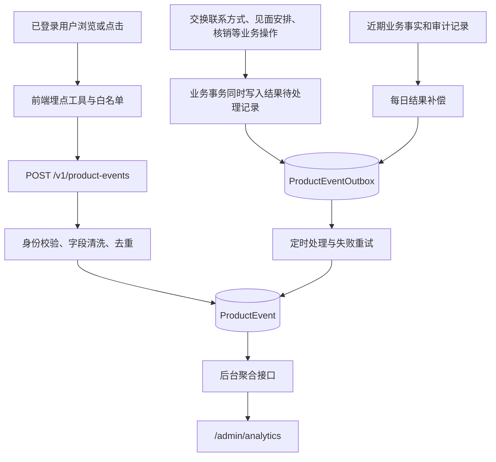

# LiLink 现有埋点现状

更新时间：2026-09-11。用途：作为埋点优化前的现状底稿，说明现在记录了什么、数据怎样产生、能回答哪些问题，以及优化应从哪里开始。

**目前已有一套自建产品埋点，但覆盖重心与下一阶段产品方向存在偏差：17 个产品事件中，9 个属于计划退出的站内见面流程；注册、资料填写和每轮报名这些主链路还缺少过程事件。后台已经展示的“转化率”也需要先统一统计口径。**

本文依据当前本地工作区的正式应用源码（`apps/web`、`apps/api`、`packages/shared`）梳理；Git HEAD 为 `3da4b13b7012f17b072a49104a36f49a1f828c0e`，工作区另有未提交修改。因此，这是工作区源码快照，不能视为该提交或线上版本的完整状态。设计副本用于核对产品决策，不重复计入正式应用的事件数量。

本文没有查询生产数据库、检查第三方平台后台或运行浏览器上报验收。下文“已实现”指源码中存在定义、调用及处理逻辑；线上是否启用、实际事件量、丢失率和调度是否正常仍待验证。优化建议单独列出，不代表已经实施。

阅读建议：讨论产品优化可先读第 1、6、8 节；查询具体事件看第 3 节，核对源码看第 10 节。

## 1. 先明确这次优化要服务哪条产品链路

当前设计记录已决定退出站内见面安排，产品流程结束于匹配、交换联系方式；正式应用尚未完成对应下线。历史匹配的最新决定则是**保留**，旧的取消决定已被撤回。依据：E01。

因此，后续重点可以围绕这条链路梳理：

> 访问 / 被邀请 → 注册 → 填写资料与问卷 → 报名本轮 → 查看匹配结果 → 交换联系方式 → 下轮继续参与。

邀请分享、优惠券和历史匹配分别作为增长、权益和回访支线。

| 用户阶段 | 当前正式源码已有的数据 | 目前主要看不清的地方 |
| --- | --- | --- |
| 访问官网、进入注册 | 全局挂载 Vercel Analytics；邀请落地页另有 `CLICK` | 自建产品事件没有匿名访客、注册入口曝光和进入路径 |
| 注册、验证、登录 | `User` 等业务记录；注册时保存邀请归因 | 各步骤曝光、尝试、失败原因、放弃位置，以及访问到注册的个人级关联 |
| 填写资料 / 问卷 | `QuestionnaireResponse` 等保存结果 | 哪个分组开始填写、在哪里退出、校验或保存失败；没有对应 `ProductEvent` |
| 报名、修改意向、取消参与 | `CycleParticipation`、首次报名时间；后台每周报名趋势 | 入口曝光 → 尝试报名 → 成功 / 失败 / 取消的过程 |
| 首页、匹配页 | 页面有效曝光；匹配页附带有无结果、是否已引荐等状态 | 具体结果区域是否被看到、不同状态下的行动差异；当前只聚合整页曝光 |
| 交换联系方式 | 点击事件 + 服务端申请结果事件 | 点击与结果逐次关联、邮件实际送达、后续双方是否联系 |
| 查看历史匹配 | 有对应业务页面和历史数据 | 未发现专门的产品行为事件；后续仍属于保留功能 |
| 站内见面安排 | 9 个产品事件，覆盖创建、提案、接受和最终确认 | 属于计划退出范围；需要安排事件及看板退役，而非默认继续补全 |
| 邀请分享 | `ReferralEvent` 的 `SHARE / CLICK`、注册归因、推广看板 | 分享是否真正发出；同一落地访客是否注册；匿名到登录后的行为关联 |
| 优惠券 | 页面曝光、点击取码、码展示、服务端核销 | 发券到核销的严格业务转化；取码 / 核销失败原因和过程耗时 |
| 跨轮次回访、留存 | 业务参与历史；部分页面有效曝光 | 没有专门留存查询；现有页面去重也不能直接充当每日访问记录 |

“缺少产品事件”不代表完全没有相关业务数据。报名成功、问卷提交、核销等结果优先复用现有业务事实，新增埋点主要补充用户过程及上下文。

## 2. 目前有哪些数据来源

| 数据来源 | 采集内容与位置 | 数据去向 / 查看入口 | 当前边界 |
| --- | --- | --- | --- |
| 自建产品埋点 | 17 个 `ProductEvent`，浏览器记录曝光和意图，API 记录业务结果 | 应用 PostgreSQL 的 `ProductEvent`；`/admin/analytics` | 仅部分已登录流程；产品原始事件保留 60 天 |
| 邀请推广记录 | `ReferralEvent` 的 `SHARE / CLICK` | 应用数据库；`/admin/promotion` | 独立于产品事件，没有统一访客 / 会话关联 |
| 业务记录 | 用户、问卷、轮次参与、匹配、活动激活、优惠券、核销 | 原业务表；运营分析和推广看板 | 可提供结果及状态，不能自动还原全部用户操作过程 |
| 审计记录 | 如 `match.contact_requested`、`meetup.final_confirmed`、`coupon.redeemed` | `AuditLog`；后台审计 | 用于操作追溯；部分记录也参与结果事件补偿，字段规则与产品事件不同 |
| Vercel Analytics | 根布局挂载 `<Analytics />` | Vercel 平台 | 源码未发现调用该 SDK 的自定义业务 `track`；平台实际采集状态未查 |
| Vercel Speed Insights | 仅当 `VERCEL_ENV === "production"` 时挂载，传入 `sampleRate={0.1}` | Vercel 平台 | 性能采集独立于自建产品事件；未验证线上启用状态 |
| Sentry | Web 客户端、服务端 / Edge，及 NestJS API 的错误、追踪、日志配置；Web 另配 Replay | Sentry 平台 | 由 DSN / 环境配置决定启用；没有接入产品转化查询 |

Sentry 的源码默认值：Web 追踪采样 `0.1`，Replay 会话采样 `0.1`、错误采样 `1.0`；API 追踪采样默认 `1`。Web / API 的 `sendDefaultPii` 默认均为 `true`，可由对应环境变量覆盖。这些是**代码配置**，不代表已验证的线上参数或实际采集字段。产品事件的字段白名单不能替代对 Sentry 等其他数据源的单独核对。依据：E17。

### 自建产品埋点的完整链路

`Outbox` 可以理解为“与业务结果一起保存的待处理事件”。它帮助结果事件在故障后重试；浏览器曝光和点击不经过这套队列。

## 3. 自建产品事件全量清单

共享契约共定义 **17 个事件：5 个曝光（`footprint`）、6 个意图（`intent`）、6 个结果（`outcome`）**。浏览器只允许写入前两类，结果事件来自服务端。枚举还预留了 `performance / frustration`，但目前没有对应事件定义或调用。依据：E02。

下表列的是**实际调用传入的业务属性**；所有浏览器事件还自动带 `viewportBucket`。契约允许的字段不一定已由每个调用点传入。

### 3.1 首页与匹配：4 个

| 事件名 | 类型 / 来源 | 真实触发点与含义 | 当前业务属性、计数边界 |
| --- | --- | --- | --- |
| `dashboard_page_viewed` | 曝光 / Web | 已登录首页容器达到有效可见条件 | `surface=dashboard_home`；当前没有传入业务 metadata；按用户在当前标签页会话内去重 |
| `match_page_viewed` | 曝光 / Web | 匹配页容器达到有效可见条件；没有匹配结果时也会记录 | `matchId`、`matchVisibility`、`introduced`、`hasMeetupSession`；按用户 + 匹配 ID（无结果用 `none`）去重 |
| `match_contact_request_clicked` | 意图 / Web | 点击交换联系方式，或在尚未引荐时点击直接邀请并准备申请联系方式 | `matchId`；`surface` 区分 `match_contact_button` 与 `match_direct_invite_button`；每次调用记录 |
| `match_contact_requested` | 结果 / API | 事务写入引荐状态、申请时间，并将引荐邮件放入发送队列 | `matchId`；按匹配 ID 生成唯一事件；表示引荐业务事务完成，不证明邮件送达或双方已联系 |

依据：E04、E07。一次直接邀请可能先产生 `meetup_entry_clicked`，再产生联系方式点击与结果；不能把它们都解释为独立用户。

### 3.2 优惠券：4 个

| 事件名 | 类型 / 来源 | 真实触发点与含义 | 当前业务属性、计数边界 |
| --- | --- | --- | --- |
| `coupon_page_viewed` | 曝光 / Web | 列表加载结束且无错误，页面容器达到可见条件；没有券时也可记录 | `availableCouponCount`，来自状态为 `ISSUED` 的列表数量；按用户去重 |
| `coupon_redeem_code_open_clicked` | 意图 / Web | 点击卡片取码，准备打开取码弹窗 | 券 ID、`couponStatus`、`availableCouponCount`；每次调用记录；此时不保证已取得码 |
| `coupon_redeem_code_displayed` | 曝光 / Web | 取码状态为 `active`，二维码容器达到可见条件 | 券 ID、`couponStatus`；按券 ID 去重；刷新动态码、再次打开同一张券通常不会再次记曝光 |
| `coupon_redeemed` | 结果 / API | 商家核销事务成功并创建对应核销业务记录 | 券 ID、`merchantId`、`couponTemplateId`；按券 ID 唯一；`userId` 是券所属用户 |

依据：E05、E08。这里的“可用券数量”严格来说是 `ISSUED` 条目数，不能脱离优惠券实际规则解释为此刻在任意商家都可使用的券数。优惠券“已读”另有业务状态维护，不等同于本表中的产品曝光事件。

### 3.3 站内见面安排：9 个，属于后续退出范围

| 事件名 | 类型 / 来源 | 真实触发点与含义 | 当前业务属性、计数边界 |
| --- | --- | --- | --- |
| `meetup_entry_clicked` | 意图 / Web | 首页议程、匹配页直接邀请 / 安排见面、见面状态条等入口点击 | 可带 `matchId / sessionId`；统一 `surface=meetup_entry`；没有区分每个入口组件；已有会话入口也会计入 |
| `meetup_flow_viewed` | 曝光 / Web | 发起页或会话详情页容器达到可见条件 | `surface=meetup_start / meetup_session`；发起页带匹配 ID，详情带业务会话与匹配 ID；分别按匹配 / 会话去重 |
| `meetup_session_created` | 结果 / API | 首次创建见面会话的事务完成 | `sessionId / matchId / proposalId`；按业务会话 ID 唯一 |
| `meetup_proposal_submit_clicked` | 意图 / Web | 表单校验后，提交首次提案、后续提案或锁定后的修改提案 | 匹配 / 会话 ID，时间及地点选项数量、有无选项、提案范围；三个 `surface` 区分首次、普通、修改表单 |
| `meetup_proposal_created` | 结果 / API | 首次、普通或修改提案成功保存 | `sessionId / matchId / proposalId`，选项数量及范围；按提案 ID 唯一；一个会话可产生多条 |
| `meetup_option_accept_clicked` | 意图 / Web | 至少选中一个时间或地点后，准备提交接受操作 | `sessionId / proposalId`、`optionKind`、有无时间 / 地点选项；没有选项而触发前端校验错误时不记录 |
| `meetup_option_accepted` | 结果 / API | 成功接受选项并写入相应消息 | 会话 / 提案 ID、接受的选项类型；按该次消息 ID 唯一，一个会话可多次接受 |
| `meetup_final_confirm_clicked` | 意图 / Web | 准备提交最终确认操作 | `sessionId`；每次调用记录 |
| `meetup_final_confirmed` | 结果 / API | 最终确认事务将安排置为 `LOCKED` 并写入确认消息 | `sessionId`；按确认消息 ID 唯一；修改安排后可再次确认；不代表线下实际见面 |

依据：E06、E09。拒绝、取消、备注、见后反馈等虽有业务操作，但不在当前 17 个产品事件中。鉴于退出决策，是否还需要补这些事件应先服从产品范围。

## 4. 事件记录了哪些字段

| 字段 | 当前实现 | 使用时的注意点 |
| --- | --- | --- |
| `eventId` | 浏览器每次尝试生成随机 ID；结果事件使用事件名 + 业务 ID | 用于幂等去重，不是用户 ID；随机点击 ID 不能自动匹配到结果事件 |
| `name / kind / source` | 固定事件白名单；落库类型和来源为大写枚举 | 当前生产逻辑使用 `WEB / API`；`SERVER` 是预留来源 |
| `eventVersion` | 当前生产调用默认 / 固定为 `1`；浏览器 DTO 允许 `1–9` | 有版本字段，但未见按事件版本区分属性规则和指标计算的实现 |
| `userId` | 浏览器事件取自服务端认证身份；结果事件由业务调用提供 | 产品接口需登录，没有匿名访客采集或登录前后身份合并；核销结果关联的是券用户 |
| 顶层 `sessionId` | 浏览器保存在 `sessionStorage` 的随机 ID | 接近标签页生命周期，没有 30 分钟无操作切分或每日重置；存储不可用时每次生成新 ID |
| `intentId / correlationId` | SDK、DTO、数据库字段均存在 | 当前页面调用未传入；结果 Outbox 也没有存储和传递这些字段，意图与结果关联尚未接通 |
| `route / surface` | 服务端按路由和事件白名单清洗；浏览器调用指定页面与位置 | 路由去掉 query / hash；非白名单值变为 `null`。结果调用通常不带页面 / 位置 |
| `entityType / entityId` | 支持券、匹配、见面会话、提案；按事件允许的类型和内部 ID 格式清洗 | 这是事件关联对象；接收层的格式清洗不等于已核实浏览器填报对象的业务归属 |
| `metadata` | 只保留事件允许的原始值字段，并校验 ID、枚举、布尔值和计数 | 不保留任意嵌套对象；计数限制为 `0–999`；未知属性会丢弃 |
| `occurredAt / createdAt` | 前者是发生时间，后者是落库时间 | 报表优先使用发生时间；超出当前时间 5 分钟的未来时间被改为当前时间，过去时间没有对应下限校验 |

**同名字段要区分：顶层 `sessionId` 是浏览器分析会话；`metadata.sessionId` 是站内见面的业务会话。服务端结果目前通常没有顶层浏览器会话 ID。**

路由白名单目前只允许 `/dashboard`、`/dashboard/match`、`/dashboard/coupons`、`/dashboard/meetup/start` 和符合内部 ID 格式的见面详情路径。新增资料、报名或注册事件时，需要同时检查路由、事件和属性规则；注册前事件还需要解决现有接收接口要求登录的问题。

当前维度情况：

- 设备只记录窗口宽度桶：`mobile < 640`，`tablet < 1024`，其余为 `desktop`；它不是实际设备型号。
- 匹配页有 `VISIBLE / LIMITED / NONE`、是否已引荐、是否存在见面会话。
- 券、商家、券模板以及见面选项可按对应事件关联；但浏览器取码事件当前没有主动传入商家 / 模板属性。
- `ProductEvent` 没有接通渠道 / 活动归因、匿名访客 ID、统一轮次 ID、实验版本、统一错误码或耗时。通过业务 ID 回查部分维度在技术上可行，当前后台未实现对应拆分。
- URL 参数、UTM 值不进入当前产品属性白名单；联系方式、文本内容、兑换码、token、精确地点等字段有过滤规则。这不表示其他业务表或第三方 SDK 使用同一规则。

依据：E02、E03、E10、E11。

## 5. 曝光、上报、去重和结果补偿的实际规则

### 5.1 “曝光”是满足可见条件后的一次记录

- 页面使用 `usePageFootprint`：页面容器有一部分进入视口，持续约 **900ms**，且标签页处于可见状态。
- 二维码容器使用 `useFootprint`：默认至少 **50%** 面积可见，持续约 **900ms**。
- 工具会检查元素及祖先的隐藏样式；没有 `IntersectionObserver` 时退回视口计算及滚动 / 尺寸监听。
- 整页曝光只证明页面容器满足这些条件，不证明用户看到了具体匹配内容、某个按钮或页面底部。
- 校验未通过的操作未必进入点击事件，例如无可接受选项时会先返回错误。

### 5.2 前端去重记的是“尝试发送过”

页面 / 码曝光使用 `onceKey`，在 `sessionStorage` 内保存去重标记；没有设置按天过期。首页、券页按用户去重，匹配页按用户 + 匹配去重，见面与码曝光按相应业务对象去重。

当前实现先写去重标记，再发请求；曝光钩子也先置为已发送。请求失败后不撤销标记，不检查 HTTP 状态和响应体，没有重试队列。因此：

- 同标签页刷新、再次进入或跨天返回可能不再产生相同曝光；这些事件次数不能直接当作 PV 或每日访问次数。
- 首次上报失败后，同一去重范围内可能一直缺少该曝光。
- 点击通常没有 `onceKey`，每次调用生成新事件 ID；用户重复点击会继续计数。
- 见面和券曝光的部分去重键不含用户 ID，SDK 内也未见统一的登录身份切换重置处理。

### 5.3 浏览器上报与服务端入库

前端使用单条 `fetch` 向 `/v1/product-events` 上报，携带认证 Cookie。点击默认启用 `keepalive`。SDK 吞掉异常以避免打断界面流程，未实现批量上报、离线补发或失败状态展示。

接口经 `JwtAuthGuard` 校验身份，再校验事件名与类型、清洗属性。正常控制器状态码为 **202**，但响应体可能是：

| 响应体 | 实际含义 |
| --- | --- |
| `{ ok: true, recorded: true }` | 已写入一条产品事件 |
| `{ ok: true, recorded: false, skipped: "duplicate" }` | 同 ID、相同核心内容的记录已存在 |
| `{ ok: true, recorded: false, skipped: "test-user" }` | 用户是测试账号或用户记录不存在，跳过写入 |

身份失效、参数错误、限流和写库失败仍可返回错误。仅看到浏览器发出了请求或收到 202，不能证明新增入库。当前 SDK 不区分这些结果。依据：E03、E10。

### 5.4 服务端结果比前端过程多一套补偿机制

| 机制 | 当前实现 |
| --- | --- |
| 业务事务 | 引荐、核销、见面操作在业务事务中同时写入 `ProductEventOutbox`；随后定时转成 `ProductEvent` |
| 普通处理 | 每 5 分钟触发；默认每批最多 50 条。仅在内存轮询窗口打开时查询数据库，启动 / 新入队会打开约 15 分钟窗口，处理和重试会延长窗口 |
| 重试 | 状态包括 `PENDING / PROCESSING / RECORDED / FAILED / EXHAUSTED`；默认最多 5 次尝试；失败后按尝试次数设置分钟级延迟，实际处理还受调度时点影响 |
| 中断恢复 | 处理中超过 10 分钟的记录可被重新领取 |
| 每日补偿 | 每日 04:00 尝试依据近 60 天的核销、联系方式申请、会话、提案及相关审计记录补回 / 重置结果 Outbox |
| 保留期限 | 每日 03:00 按 `createdAt` 删除超过 60 天的产品事件及 Outbox；这些 Cron 没有单独指定时区，依赖运行进程时区 |
| 测试账号 | 产品事件写入和结果入队均排除 `isTest`；管理端将用户改为测试账号时还会删除其已有产品事件和 Outbox |

当前业务调用后未发现主动即时执行产品 Outbox flush 的路径，因此看板中的结果可能稍后才出现。后台没有展示队列积压、失败比例或结果补偿状态。

浏览器异常不打断界面，与服务端的事务边界要分开理解：Outbox 的写入位于业务事务内，若这一步抛错会影响该事务；事件从 Outbox 转存失败则可以随后重试。

保留期限按落库时间计算，报表按发生时间计算，两者不是同一个窗口。结果可以基于业务事实尝试补偿，丢失的浏览器曝光 / 点击没有同等补偿来源。依据：E07–E11、E18。

## 6. 后台现在怎么算指标

### 6.1 产品分析看板

页面：`/admin/analytics`。产品数据接口：`GET /v1/admin/analytics/product-funnels`，受管理员权限保护。

接口支持滚动的 `7d / 30d / 60d`，默认 `7d`，范围为 `[当前时间减 N 天, 当前时间)`；按 `COALESCE(occurredAt, createdAt)` 过滤。`includeTest` 默认关闭，但开启它也不能找回采集时就跳过或已经删除的测试事件。

| 页面指标 | 当前真实公式 | 应怎样理解 |
| --- | --- | --- |
| 活跃用户 | 时间窗内 `ProductEvent.userId` 的非空去重数 | 只覆盖这些事件涉及的用户；还包括 API 结果，例如商家核销关联的券用户，不能直接等同于全站主动访问用户 |
| 事件总数 | 时间窗内全部产品事件行数 | 事件次数，混合曝光、点击和结果 |
| 今日新增事件 | 运行进程当天零点至当前时间的事件行数 | 依赖服务器时区；与滚动 N 天口径不同 |
| 优惠券兑换率 | `coupon_redeemed` 次数 ÷ `coupon_page_viewed` 次数 | 分子按券，分母为去重后的页面曝光；不是已发券核销率，也不是去重用户转化率 |
| 约见完成率 | `meetup_final_confirmed` 次数 ÷ `meetup_entry_clicked` 次数 | 分子按确认消息，分母按入口点击；不代表线下见面完成率，并且涉及退出中的功能 |
| 报名转化率 | 固定 `null`，页面显示“未接入” | 已明确缺少入口曝光和提交事件 |
| 每一步漏斗数量 | 按事件名独立 `COUNT(*)` | 没有关联同一用户、同一业务对象、先后顺序或转化时限 |
| 漏斗百分比 | 当前步骤次数 ÷ 第一步次数；另显示当前步骤 ÷ 上一步 | 页面文案“环比上一步”实际是步骤间比例，不是时间环比 |

KPI 比率在分母为 0 时返回 `null`；漏斗展示组件在分母为 0 时显示 `0%`。两处空分母处理也不一致。

当前三个漏斗分别是匹配触达、优惠券、约见。所有步骤都是同一时间窗中的独立计数，**没有构成严格的同一批对象逐步转化**。例如，假设一个用户打开一次券页后核销两张券，当前公式会得到 `2 / 1 = 200%`。这是公式示例，不是线上实测结果。

还有三个容易误读的地方：

1. 联系方式结果按一组匹配只记录一次；双方的点击、曝光却可能分别产生。按用户统计还是按匹配双方组成的一组统计，需要另行定义。
2. 约见列表把“会话创建”放在“提交提案点击”前，但首次创建时实际是先提交表单，再在同一事务内创建会话和首条提案；后续提案和修改又可重复发生。这不是一条单向漏斗。
3. 现有接口的已知缺口只列“报名转化率”和“KPI 环比趋势”，没有涵盖前述计数单位、身份关联、数据延迟等问题。

接口尚未提供按入口、学校、设备、轮次、渠道或事件版本拆分，也没有事件明细查询、路径分析和留存分析。原始事件只保留 60 天，当前未发现产品事件长期日汇总实现；更长周期比较需要另行安排。依据：E12、E13。

### 6.2 同页还有直接从业务表计算的指标

| 数据区 | 当前来源和范围 |
| --- | --- |
| 学校 / 性别分布 | `User / School / QuestionnaireResponse`，性别取已提交问卷中的对应答案 |
| 每周报名趋势 | 最近若干匹配轮次的 `CycleParticipation`；只计 `OPTED_IN` 且意向非空的记录；页面请求最近 8 轮 |
| 匹配排行榜 | 用户的已揭晓参与 / 匹配业务历史，计算报名轮数、匹配轮数和连续匹配 / 未匹配等指标 |

页面的 `7d / 30d / 60d` 选择只传给产品漏斗接口，不会把学校分布、最近 8 轮报名和全历史匹配排行都改成同一个时间窗。依据：E12、E13。

## 7. 邀请推广：独立采集、独立口径

### 7.1 两类 ReferralEvent

| 记录类型 | 调用与接口 | 真实语义和去重 |
| --- | --- | --- |
| `SHARE` | 邀请页 / 分享面板 → `POST /v1/referral/events`；需登录 | 普通渠道在复制链接成功后上报；二维码渠道在选择展示二维码时上报。每次调用计数，没有去重；不能证明已经发送到微信或被他人收到 |
| `CLICK` | `/i/[code]` 页面执行客户端逻辑 → `POST /v1/referral/click`；公开接口 | 后端验证个人推荐码可用后写入，过滤机器人 / 预览类 UA。按“推荐码 + UTC 日期 + 访客哈希”去重，不是全站 PV 或真实个人 UV |

当前渠道为 `WECHAT_MOMENTS / WECHAT_GROUP / WECHAT_PRIVATE / COPY_LINK / QR / OTHER`。

访客哈希由服务端根据 IP、UA 和服务端盐值计算，原始 IP / UA 不写入这条记录。同网络、相同 UA 可能合并，不同网络也可能拆开同一人；它适合有限的重复访问抑制，不能作为稳定用户身份。

`CLICK` 的去重键不包含渠道和活动，同一天同一访客通过同一推荐码切换渠道 / 活动访问，后一次不会新增该记录。无效、非活跃推荐人或非校园邀请额度已用完的链接返回 `INVALID`，也不会记为有效点击。

活动归因优先采用请求中有效且为 `ACTIVE` 的 `campaignSlug`，否则使用当前有效默认活动。接口支持分享时传活动参数，但当前分享页面调用只传渠道；落地点击则会读取链接的 `ch / c` 参数。

测试过滤存在差异：`SHARE` 写入检查推荐人 `isTest`，`CLICK` 写入没有这项检查；推广看板查询 `SHARE / CLICK` 时也没有关联推荐人进行测试过滤。因此测试来源仍可能影响点击统计，具体污染程度尚未查询。依据：E14、E15。

### 7.2 从落地页到注册的归因

有效邀请链接返回 `OK` 后，落地页写入保存推荐码、渠道、活动参数的 `lilink_ref` Cookie，有效期 30 天，并跳转个人邮箱注册页。再次成功访问邀请链接会覆盖该 Cookie；注册表单读取它，注册成功后清除。

注册服务在业务事务内将推荐人、渠道、活动保存到用户记录，后续活动归因读取这份冻结结果。Cookie 没有携带 `visitorHash` 或某次 `CLICK` 的 ID，注册接口也没有将该访客标识接到 `ProductEvent`。因此当前能按推荐人 / 活动归因注册结果，不能逐个验证“这位点击访客后来注册并执行了哪些产品行为”。

手动填写推荐码、直接注册或默认活动归因等情况也可能产生注册结果而没有前序 `CLICK`，不能假设所有注册用户都属于点击人群。依据：E14–E16。

### 7.3 推广看板和产品看板不能直接按总数对齐

推广入口是 `/admin/promotion`，漏斗接口为 `GET /v1/admin/promotion/funnel`。其统计结构是：

| 步骤 | 当前口径 |
| --- | --- |
| `SHARE / CLICK` | 活动下、指定时间窗内的事件记录数；两者去重方式不同 |
| `REGISTER` | 归因到该活动、在时间窗内注册的非测试用户数 |
| `ACTIVATE` | 上述注册用户中已有该活动 `CampaignActivation` 的人数 |
| `GRANT` | 上述注册用户中已持有该活动优惠券的人数 |
| `REDEEM` | 上述注册用户中至少有一张该活动券已核销的人数 |

后四步是“本期注册的一批用户”的后续结果，其激活 / 发券 / 核销子查询没有再限制动作必须发生于同一时间窗。前两步则是窗口内发生的独立事件，两部分没有按同一访客关联。

这里的活动激活以业务 `CampaignActivation` 记录为准：当前创建路径要求已提交问卷、有首次报名记录、存在冻结活动且活动仍有效；不是“第一次登录”。例如，产品看板核销统计的是窗口内的**核销券数**，推广漏斗核销统计的是本期注册用户中**至少核销过一张券的人数**，两者不同是正常的口径差异。

当前推广查询直接聚合业务表；代码注释提到的 `DailyCampaignStat` 预留方案没有对应的现行模型 / 写入实现。本次也未发现 `ReferralEvent` 按天定时清理的实现，不能把产品事件的 60 天保留规则套用到它。依据：E15、E16。

## 8. 建议的优化顺序

本节是基于当前实现和已记录产品方向的建议，未更改事件定义、业务代码、看板或数据。

### 第一步：先让已有指标可解释

| 优先事项 | 建议形成的明确结果 |
| --- | --- |
| 对齐保留范围 | 将 9 个见面事件和约见 KPI 标为待退役范围，随正式功能下线安排停止采集、看板退出和历史口径保留；保留历史匹配的后续埋点规划 |
| 定义核心成功 | 区分注册完成、资料完整、报名成功、看到有效匹配、交换联系方式事务成功；邮件送达和线下联系另立口径，不能从当前结果事件推定 |
| 确定统计单位 | 每个指标明确按用户、用户 × 轮次、匹配组还是优惠券计数；漏斗固定同一批对象、先后顺序、转化时限及去重规则 |
| 修正现有命名与展示 | 保留“事件次数”作为原始统计；严格转化查询完成前，让看板文字明确表达次数之比。统一空分母展示，区分步骤转化与时间环比 |
| 明确时间与历史 | 统一业务时区、发生 / 入库时间使用规则；评估 60 天是否足够支持跨轮次和学期比较，确定汇总保留需求 |

### 第二步：补齐保留主链路的少量关键节点

下表是**待设计的采集语义，不是已上线事件名称**。建议先确认每个节点要支持的决策，再给它命名、定义属性和实现方式。

| 链路 | 建议补充的节点 | 可优先复用的结果依据 |
| --- | --- | --- |
| 访问 → 注册 | 注册入口曝光、开始注册、关键提交、成功 / 失败，区分校园与个人邮箱入口 | 注册业务事务与用户记录 |
| 注册 → 资料完整 | 资料页 / 分组曝光、开始填写、完整提交、保存或校验失败 | 问卷提交与资料保存结果；属性记录分组 / 原因分类，不记录原始答案 |
| 资料完整 → 报名 | 本轮入口曝光、报名尝试、成功 / 失败、修改意向、取消报名 | `CycleParticipation`；带轮次和业务状态，避免仅按“提交次数”衡量参与 |
| 揭晓 → 交换联系方式 | 区分有效匹配结果曝光与无结果页浏览；关联已有联系方式点击及事务结果 | `Match / MatchParticipant`；定义用户和匹配组两种口径的用途 |
| 回访与历史匹配 | 历史入口点击、实际历史结果曝光，以及按用户 × 日期 / 轮次衡量回访 | 现有业务历史；避免把一次标签页曝光当作每日回访 |
| 邀请 / 权益支线 | 保留分享意图与有效落地，明确归因规则；补取码、核销失败分类 | 冻结的注册归因、活动激活、券及核销记录 |

### 第三步：把采集质量和分析查询补上

- **曝光成功率**：区分待发送、已入库、重复、跳过和失败；明确是否重试，以及重试如何复用 `eventId`。先解决发送前去重导致的静默缺失。
- **身份与过程关联**：确定是否需要匿名到登录的关联；为一次操作和结果传递稳定关联标识。若采用现有 `intentId / correlationId`，需要同时接通业务请求、Outbox 和消费端。
- **最小上下文**：根据决策需要补入口、轮次、业务状态、失败原因、事件版本；避免只扩充字段白名单而没有实际调用和查询。
- **结果监控**：让 Outbox 积压、失败 / 耗尽、处理延迟、补偿数量可见，并定期将结果事件与业务表对账。
- **统一测试口径**：明确产品和推广数据如何排除测试来源；不要依赖看板的 `includeTest` 开关绕过采集端跳过逻辑。
- **查询消费**：实现按同一批对象计算的漏斗、学校 / 设备 / 轮次拆分、前后时间窗比较和留存；对统计单位不同的看板保留清楚说明。

新增或修改事件时，建议至少约定：业务问题、事件含义、触发 / 不触发条件、生产端、关联对象、属性及允许值、去重单位、发生时间、事件版本、消费指标、维护人和验收样例。现有共享白名单可以继续作为代码契约，但还需要与产品指标定义对应起来。

## 9. 目前的证据与下一次验收怎么做

本次完成的是源码交叉梳理和文档一致性检查。仓库中已有以下测试材料，但**本次未运行这些业务测试，未执行线上上报或生产对账**：

| 已有测试材料 | 覆盖内容 |
| --- | --- |
| 共享层产品事件测试 | 事件定义、字段白名单、敏感值过滤、路由 / 实体 / 事件 ID 规则 |
| API 产品事件服务测试 | 浏览器写入限制、测试用户跳过、幂等、Outbox、重试恢复、补偿和 60 天清理 |
| 引荐 / 核销 / 见面服务测试 | 对应业务调用中结果 Outbox 的写入 |
| 管理分析服务测试 | 现有计数、比率和缺口返回；验证当前实现，不证明指标满足严格漏斗定义 |
| 推荐服务测试 | 分享记录、点击去重、无效推荐码与活动归因等 |

本次在 Web 源码、API e2e 目录及相关脚本中未找到专门覆盖 ProductEvent 浏览器钩子到真实数据库的完整端到端验收。对应测试入口见 E19。

后续修改后，建议用隔离环境的合成数据跑以下链路，并保留请求、数据库结果和看板结果。正常链路样例应使用隔离环境中允许计入分析的合成账号；单独再验证 `isTest=true` 的排除行为。

| 验收场景 | 可判定的成功信号 |
| --- | --- |
| 页面曝光 | 可见 900ms 后恰好产生符合约定的记录；短暂进入、隐藏标签页、跨天回访分别符合新定义 |
| 曝光上报失败 | 人为制造断网 / 401 / 500，确认是否重试、是否留有待处理记录；恢复后不重复计数 |
| 关键动作失败 / 成功 | 失败只有已约定的尝试 / 失败事件；业务成功后能关联到对应结果；不把按钮点击当成功 |
| 幂等与结果延迟 | 同 ID 重发不新增；业务提交、Outbox 处理、ProductEvent 入库均能查到；看板延迟可解释 |
| 测试与归因 | 测试账号按约定排除；同邀请链接重复 / 换渠道访问、注册后的归因能按规则对账 |
| 指标口径 | 用“一人多券”“双方一组匹配”“跨窗口转化”等样例，验证按人数 / 业务对象计算的结果 |
| 见面功能退出 | 正式入口和相关结果生产端退出后，旧事件不会继续进入新主链路 KPI；历史数据解释仍清楚 |

线上实际启用状态、各事件最近出现时间、事件量、属性缺失率、重复率、Outbox 积压与第三方平台配置，留待下一次运行态核验，不在本文中虚构数值。

## 10. 源码与决策证据索引

链接按本文所在目录解析。定位以文件和符号为主，后续源码变化时应重新核对。

| 编号 | 证据入口 | 对应内容 |
| --- | --- | --- |
| E01 | [个人资料层级与见面流程退出](../2026秋季开学视觉重构/07-个人资料层级与见面流程退出.md)、[匹配历史最新决定](../2026秋季开学视觉重构/10-匹配历史退出与举报入口决策.md) | 设计副本决定与正式应用实施边界；历史匹配最新保留决定 |
| E02 | [共享产品事件契约](../../packages/shared/src/product-analytics.ts) | `PRODUCT_EVENT_NAMES`、`PRODUCT_EVENT_DEFINITIONS`、各 sanitizer；17 个事件与允许字段 |
| E03 | [Web 产品埋点工具](../../apps/web/src/lib/product-analytics.ts) | `useObservedFootprint`、`trackProductEvent`、`reserveOnceEvent`、`readSessionId` |
| E04 | [首页](../../apps/web/src/app/dashboard/home-client.tsx)、[匹配页](../../apps/web/src/app/dashboard/match/match-client.tsx) | 首页 / 匹配曝光、联系方式点击、直接邀请入口 |
| E05 | [优惠券页面与取码弹窗](../../apps/web/src/app/dashboard/coupons/coupons-client.tsx) | 页面、点击取码、二维码曝光的实际条件 |
| E06 | [见面客户端](../../apps/web/src/app/dashboard/meetup/_components/MeetupClient.tsx)、[议程入口](../../apps/web/src/app/dashboard/_components/AgendaList.tsx)、[见面状态条](../../apps/web/src/app/dashboard/_components/MeetupStatusRibbon.tsx) | 发起 / 详情曝光、提交意图及多个入口 |
| E07 | [账号业务服务](../../apps/api/src/modules/account/account.service.ts) | `enqueueMatchContactRequestedOutcome` 调用所在事务、引荐状态及邮件入队 |
| E08 | [核销业务服务](../../apps/api/src/modules/redemption/redemption.service.ts) | `enqueueCouponRedeemedOutcome` 调用及成功事务 |
| E09 | [见面业务服务](../../apps/api/src/modules/meetup/meetup.service.ts) | 会话 / 提案 / 接受 / 确认结果；`finalConfirm` 写 `LOCKED` |
| E10 | [产品事件控制器](../../apps/api/src/modules/product-analytics/product-analytics.controller.ts)、[DTO](../../apps/api/src/modules/product-analytics/dto.ts)、[服务](../../apps/api/src/modules/product-analytics/product-analytics.service.ts)、[API 启动](../../apps/api/src/main.ts) | `/v1` 前缀、认证、202、`recordBrowserEvent / recordEvent`、Outbox、补偿和保留规则 |
| E11 | [Prisma Schema](../../apps/api/prisma/schema.prisma) | `ProductEvent / ProductEventOutbox / ReferralEvent / CampaignActivation / AuditLog` 及关联业务模型 |
| E12 | [管理分析服务](../../apps/api/src/modules/admin-analytics/admin-analytics.service.ts)、[查询 DTO](../../apps/api/src/modules/admin-analytics/dto/analytics-query.dto.ts)、[控制器](../../apps/api/src/modules/admin-analytics/admin-analytics.controller.ts) | `productFunnels`、公式、时间窗、已知缺口及业务统计 |
| E13 | [产品分析页面](../../apps/web/src/app/admin/analytics/AdminAnalyticsDashboard.tsx)、[漏斗展示](../../apps/web/src/app/admin/analytics/FunnelPanel.tsx) | KPI 文案、各接口参数、空分母、步骤百分比 |
| E14 | [邀请落地页](../../apps/web/src/app/i/[code]/landing-client.tsx)、[邀请页](../../apps/web/src/app/dashboard/referrals/referrals-client.tsx)、[分享面板](../../apps/web/src/app/dashboard/referrals/ReferralShareSheet.tsx)、[注册归因 Hook](../../apps/web/src/app/register/use-referral-attribution.ts)、[Web API](../../apps/web/src/lib/api.ts) | 分享 / 点击真实触发、30 天 Cookie、注册读取的属性 |
| E15 | [推荐控制器](../../apps/api/src/modules/referral/referral.controller.ts)、[推荐服务](../../apps/api/src/modules/referral/referral.service.ts)、[注册服务](../../apps/api/src/modules/auth/auth.service.ts) | 访客哈希、UTC 日去重、测试过滤差异、归因解析与注册冻结 |
| E16 | [推广分析服务](../../apps/api/src/modules/promotion-dashboard/promotion-dashboard.service.ts)、[推广控制器](../../apps/api/src/modules/promotion-dashboard/promotion-dashboard.controller.ts)、[活动激活服务](../../apps/api/src/modules/activation/activation.service.ts) | `getFunnel` 的注册人群、后续结果统计与活动激活条件 |
| E17 | [根布局](../../apps/web/src/app/layout.tsx)、[Web Sentry 客户端](../../apps/web/src/instrumentation-client.ts)、[Web Sentry 配置](../../apps/web/src/lib/sentry-config.ts)、[服务端配置](../../apps/web/sentry.server.config.ts)、[Edge 配置](../../apps/web/sentry.edge.config.ts)、[API Sentry](../../apps/api/src/instrument.ts)、[API 环境配置定义](../../apps/api/src/config/env.ts) | Vercel 两项集成、Sentry 开关及采样默认值；未读取凭据文件 |
| E18 | [管理服务](../../apps/api/src/modules/admin/admin.service.ts) | `setTestFlag` 删除产品事件 / Outbox；批量测试数据清理路径 |
| E19 | [共享契约测试](../../packages/shared/test/product-analytics.test.js)、[产品事件服务测试](../../apps/api/src/modules/product-analytics/product-analytics.service.spec.ts)、[管理分析测试](../../apps/api/src/modules/admin-analytics/admin-analytics.service.spec.ts)、[推荐服务测试](../../apps/api/src/modules/referral/referral.service.spec.ts)、[账号服务测试](../../apps/api/src/modules/account/account.service.spec.ts)、[核销服务测试](../../apps/api/src/modules/redemption/redemption.service.spec.ts)、[见面服务测试](../../apps/api/src/modules/meetup/meetup.service.spec.ts) | 已存在的测试材料；本次未执行 |
