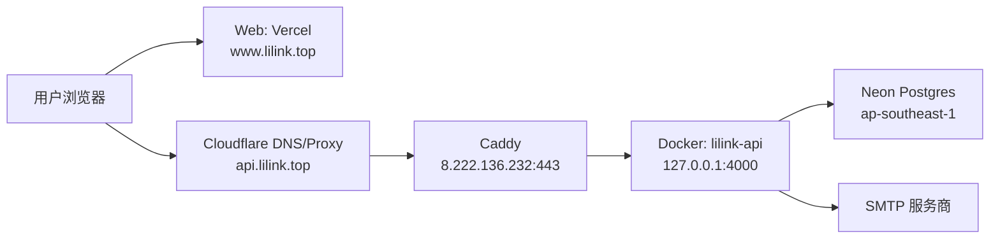

# LiLink 生产基建拓扑

## 总览

## 入口与 DNS

| 名称 | 当前状态 | 基建归属 | 备注 |
|------|----------|----------|------|
| `www.lilink.top` | Web 正式入口，HTTP 200 | Vercel | 首页实际服务域名 |
| `lilink.top` | 307 跳转到 `www.lilink.top` | Vercel | 根域不直接承载页面 |
| `api.lilink.top` | API 正式入口，HTTP 200 | Cloudflare → Caddy → API | 健康接口 `/v1/health`；DB 链路接口 `/v1/public/landing` |
| `lilink.app` / `www.lilink.app` / `api.lilink.app` | NXDOMAIN | 无 | 当前不是生产入口 |

观测 DNS：`api.lilink.top` 解析到 Cloudflare；`lilink.top` 指向 Vercel；`www.lilink.top` 为 Vercel CNAME。

## 生产宿主机

| 项 | 值 |
|----|-----|
| 代码目录 | `/home/admin/lilink` |
| Compose 文件 | `/home/admin/lilink/docker-compose.prod.yml` |
| Compose project | `lilink` |
| 生产 profile | 无；生产命令显式指定 `docker-compose.prod.yml` |
| 生产容器 | 仅 `lilink-api` |
| API 监听 | 宿主机 `127.0.0.1:4000`，不直接暴露公网 |
| 公网入口 | Caddy 监听 `443`，反代到 `127.0.0.1:4000` |

## 运行组件

| 层 | 组件 | 当前真实状态 | 关键边界 |
|----|------|--------------|----------|
| Web | Vercel Next.js | 独立于生产机运行 | 生产机只承载 API，不承载 Web |
| API | Docker 容器 `lilink-api` | Up；镜像名 `lilink-api`；无 Docker healthcheck | 容器端口 `4000` 仅绑定宿主机 loopback |
| Reverse proxy | systemd `caddy` | active；服务启动配置被 override | 生效配置不是 `/etc/caddy/Caddyfile` |
| Database | Neon Postgres | API 通过 `DATABASE_URL` 连接；schema up to date | 生产机无本地数据库容器 |
| Mail | 外部 SMTP | 由 API `.env` 控制 | 邮件投递成功需看队列/服务商，不等同于 HTTP 成功 |

## Caddy

| 项 | 值 |
|----|-----|
| systemd service | `caddy.service` |
| 生效配置文件 | `/home/admin/lilink/Caddyfile` |
| systemd override | `/etc/systemd/system/caddy.service.d/override.conf` |
| 站点 | `api.lilink.top` |
| 反代目标 | `127.0.0.1:4000` |
| 压缩 | `zstd`, `gzip` |
| 非生效配置 | `/etc/caddy/Caddyfile` |

## API 容器

| 项 | 值 |
|----|-----|
| 容器名 | `lilink-api` |
| 镜像 | `lilink-api` |
| 宿主机端口 | `127.0.0.1:4000` |
| 容器端口 | `4000/tcp` |
| Compose 服务 | `api` |
| 生产启动职责 | `production-entrypoint.mjs` 读取 Docker secret env → Prisma migrate deploy → bootstrap admin → Nest API |
| 回滚约定 | 本地 Docker tag `lilink-api:previous-good` |
| 本次核验 | running；restart count `0`；最近 24h error-like 日志 `0` |

## 数据库

| 项 | 值 |
|----|-----|
| 类型 | Neon Postgres |
| 连接来源 | `/home/admin/lilink/.env` 通过 Docker secret `api_env` 提供的 `DATABASE_URL` |
| Prisma 状态 | 28 migrations；schema up to date |
| 区域观测 | `ap-southeast-1` |
| DB-backed API 观测 | `/v1/public/landing` HTTP 200 |
| 本机 Postgres | 生产不运行 `lilink-postgres` |
| 本地备份脚本 | `scripts/backup-postgres.sh` 依赖本地 `lilink-postgres`，不适用于当前生产 Neon |
| 数据恢复 | 走 Neon 备份/分支/PITR 或既定恢复流程 |

## 配置与秘密

| 项 | 位置 | 说明 |
|----|------|------|
| 生产环境变量 | `/home/admin/lilink/.env` | API、DB、JWT、SMTP、cookie 等生产配置；作为 Docker secret 挂载，不使用 compose `env_file` |
| API 代码 | `/home/admin/lilink/apps/api` | NestJS API 与 Prisma schema |
| Web 代码 | Vercel 部署来源 | 生产运行不在 API 宿主机 |
| Caddy 配置 | `/home/admin/lilink/Caddyfile` | API 公网入口唯一反代配置 |
| 敏感信息红线 | `.env`, `DATABASE_URL`, JWT secrets, SMTP secrets | 不打印、不贴日志、不提交 Git |

## 健康信号

| 信号 | 正常含义 |
|------|----------|
| `https://api.lilink.top/v1/health` HTTP 200 | Caddy、公网 TLS、API 进程可达 |
| `http://127.0.0.1:4000/v1/health` HTTP 200 | API 宿主机本地可达 |
| `https://api.lilink.top/v1/public/landing` HTTP 200 | API 到 Neon 的读链路可用 |
| `https://www.lilink.top/` HTTP 200 | Web/Vercel 可用 |
| `https://lilink.top/` HTTP 307 | 根域按预期跳转到 `www` |
